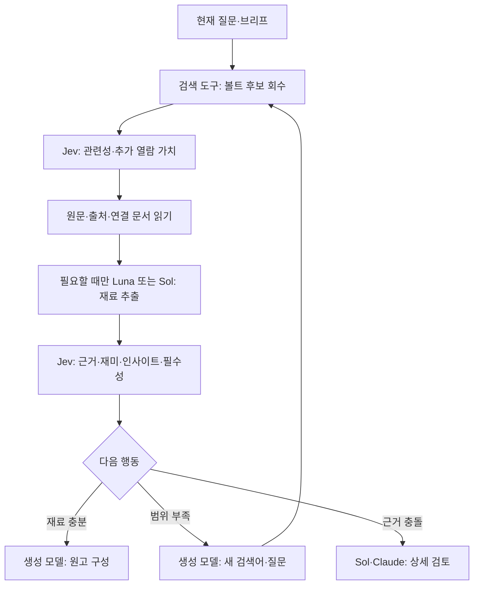

# Auto Kairos 전체: Jev × Sol/Luna 적용 검토

2026-09-21. **Jev는 전 제작 과정의 반복 선택·분류·충족도 판단에 연결할 수 있습니다. 핵심 기회는 생성 모델을 없애는 것이 아니라, 자료 열람·후보 생성·재검색·재생성·상위 검토를 필요한 곳에 집중하는 데 있습니다.** 이번 작업은 실제 코드 접점과 기존 실험 증거를 대조한 전 범위 감사입니다. 새 기능 구현이나 전체 파이프라인 실효성 입증은 아닙니다.

[전체72항목 상세표](2026-09-21-jev-hybrid-capability-catalog.md) · [기계 판독 목록](2026-09-21-jev-hybrid-full-audit.json)

기존60개 후보를 모두 유지하고 최근 논의의 세부12개를 추가했습니다. 일부는 상위 기능의 세분화이므로 독립 기능72개나 가능한 모든 미래 기능의 수학적 완전 목록을 뜻하지 않습니다. Stage0/4, Stage1–3, NAS/볼트, 에셋·모션, 음성·자막, Adobe/Remotion 접점, 배포·멀티포맷, 운영 제어를 확인했습니다. 목록의 코드 경로 존재도 검사했습니다.

## 현재 코드에서 확인한 사실

|영역|확인한 연결|해석|
|---|---|---|
|타겟 리서치|runner의 prepare_targeted_context → jev_targeted.py|이미 부분 연결. 질문은 기존 LLM이 만들고 Jev는 검색결과·본문 구간 선택과 근거 충분성 판단을 보조합니다. 재미·인사이트 재료 평가 전체는 아닙니다.|
|씬 에셋|scene_enricher_module → SceneJudge → AssetObserver|이미 부분 연결. 정지 이미지 관찰에 근거한 후보 선택. 영상 전체·최종 렌더의 연출 검수가 자동으로 완성된 것은 아닙니다.|
|볼트 토픽 매칭|vault_lookup.match_vault_topics|기존 Claude CLI가 주제 슬러그를 연결합니다. Jev 대체 비교의 명확한 접점이나 현재 Jev 연결은 없습니다.|
|볼트 검색|VaultRAG.semantic_search, keyword/tags/backlinks|검색 기능은 존재. 의미검색은 Chroma 사용, 실패 시 키워드 폴백. 현재 snippet은200자로 잘리므로 재료 가치 판정 전에 원문 문맥을 더 읽어야 합니다.|
|근거 회수|fact_retriever, evidence_check|의미상 주장 지지는 모델, 원문에 인용구가 실제 존재하는지는 코드로 나눌 수 있습니다. 문자열 일치만으로 참/거짓이 확정되지는 않습니다.|
|챕터 재료|chapter_projection_module|이미 자료→chapter_facts 생성 접점 존재. Jev로 재료를 먼저 분류하고 LLM이 챕터 자료를 구성하는 방식은 추가 설계가 필요합니다.|
|모델 라우팅|runner.CODEX_RESEARCH_AGENTS|flesh-researcher/targeted-researcher만 Codex provider로 분기하는 경로를 확인했습니다. Stage0/4 AgentRunner도 Codex 지원. 전체 agent가 모델 설정 하나로 Sol/Luna에 전환되는 구조는 아닙니다.|
|구독 이미지 관찰|subscription_vision.py|Codex/Claude 로그인 확인, API 키 제거, 직접 이미지 전달 경로 존재. 다른 일반 에이전트 경로까지 동일한 구독 보호를 적용했다고 가정하면 안 됩니다.|

타겟 리서치는 TYPESAFE_API_KEY와 SERPER_API_KEY가 있을 때, 씬 검토는 TYPESAFE_API_KEY가 있을 때 활성화 가능한 구조이며 명시적 opt-out이 있습니다. 오류·키 없음은 기존 경로로 돌아가야 한다는 현재 계약을 확장 기능에서도 유지해야 합니다. 키 값이나 계정 정보는 출력하지 않았습니다.

현재 `/Volumes`에는 Macintosh HD만 보여 기본 NAS 경로의 실제 마운트를 확인하지 못했습니다. 별도 환경변수 경로 또는 로컬 볼트의 유무까지 NAS 부재로 단정하지 않습니다. 이번 검토에서는 실제 NAS 검색을 실행하지 않았습니다.

## 전 단계에서의 역할 분담

|단계|생성 모델 담당|Jev 담당 후보|코드·도구 담당|
|---|---|---|---|
|소재 발굴|기사 맥락 추출·기획 각도 작성|채널 적합·중복/후속·조사 우선순위|피드 수집·시각/기간 계산|
|브리프·시리즈|핵심 질문·소구점 해석·편 구성|요구 충족·범위·질문/편 배정|필수요구ID·버전 관리|
|초기 리서치|검색어·동의어·관점 후보 생성|볼트/뉴스/논문 경로와 열람 후보 선택|검색·원문 확보·출처 보존|
|심층 리서치|사건·기제·맥락 추출·새 가설 작성|재미·설명력·인사이트·근거·중복 평가|원문 위치·주장ID·출처 연결|
|타겟 리서치|WHY/HOW 질문·후속검색·답변 작성|질문의 필요성·빈틈·근거충족·다음 조사 선택|쿼리 실행·횟수·예산 제한|
|원고|서사·문장·비유·대안 작성|사례/훅 선택·정의 필요·요구 누락·의미 회귀|문자수·사실필드·변경추적|
|래칫|서술형 비평·고칠 이유·최종 개선 판단|선택적 국소 검사만 후보|버전·실패/보류 상태 유지|
|씬·연출|씬 분할·샷·표현 방식 후보 작성|자료/재연/도해 선택·전후 관계·내용 적합성|씬ID·타이밍·허용 템플릿|
|이미지·레퍼런스|실제 이미지 관찰·프롬프트 작성|재사용·후보 선택·결손·재검색/수정 분류|검색·다운로드·해시·파일 관리|
|모션·조립|레이어/카메라 계획·렌더 관찰|프리셋·강조 대상·전환 후보 선택|좌표·세이프존·크롭·렌더|
|음성·자막|발음/호흡 후보·결함 해석|문맥상 발음·의미 경계·재검토 대상 선택|TTS·ASR·정렬·길이 측정|
|배포·멀티포맷|제목/설명·카드/쇼츠 원고 작성|제목-본문 약속 일치·독립 구간·형식 적합|규격·타임코드·출력 패키지|
|성과·운영|성과 해석·가설·실험/복구안 작성|댓글 분류·실험 후보·다음 담당 선택|통계·허용행동·리트라이·예산|

게시와 외부 메시지는 기존 권한 경계를 유지합니다. 판단 모델의 선택 자체가 게시 권한은 아닙니다. 이미지 생성은 사용자 지정 Codex imagegen 경로를 유지합니다.

## 가장 중요한 설계: 콘텐츠 재료 평가

'좋은 자료인가'를 한 점수로 만들지 않습니다. 다음 축을 별도로 둡니다.

- **재미 잠재력:** 구체적 인물·행동·갈등·반전·실패가 있는가. 실제 재미나 시청 지속률을 측정한 값은 아님.
- **설명/인사이트:** 왜·어떻게에 답하고 기제를 드러내는가. 새로워 보인다는 이유로 사실로 채택하지 않음.
- **근거 적합성:** 원문이 해당 주장을 어떤 범위·조건에서 지지하는가. 당사자 발표/독립근거/전재 구분.
- **증분 가치:** 기존 재료의 반복인가, 빈틈 보강인가, 새로운 관점인가.
- **시각화 가능성:** 인물·사물·장소·행동·비교를 보여줄 자료가 있거나 구체적으로 만들 수 있는가.
- **필수성:** 재미가 약해도 이해·근거·광고주 필수요구에 꼭 필요한가.

강한 재미+약한 근거는 '채택'이 아니라 추가 검증 후보입니다. 약한 재미+강한 필수 근거는 삭제하지 않습니다. 핵심 주장에 반하는 자료도 보존하고 상위 검토로 보냅니다. 이 처리는 재미 최적화 때문에 사실성과 설명력을 잃지 않기 위해 필요합니다.

재료 카드의 권장 필드: material_id, 원문 경로/URL, 문서해시, 구간 위치와 원문 인용, 출처/작성일, 주장과 조건, 현재 질문/챕터ID, 관련 기존 재료ID, Jev 축별 결과와 분포, LLM 검토 여부. LLM이 만든 요약·추론은 원문과 별도 필드에 둡니다. Jev 결과의 문장 표현은 템플릿이거나 LLM의 사후 설명이라고 표시합니다.

Score는 각 수준의 실제 상황을 서술한2~10단계 기준으로, Choice는 의미 있는 후보ID로 사용합니다. 서로 다른 축을 원시 점수로 합산하지 않고 필수요건과 근거 결손을 먼저 처리합니다. confidence는 정답 확률로 취급하지 않고 실제 검증 세트에서 분기 기준을 보정해야 합니다.

## NAS/볼트에서 완성할 수 있는 흐름

각 검색에는 검색 범위·시간·후보 수·실패 여부를 남깁니다. '검색 결과 없음', '접근 실패', '후보는 있으나 부적합', '충분한 근거 없음'은 다른 상태입니다. Jev가 NAS 전체에 자료가 없다고 확정하게 하지 않습니다. 존재·동일해시·권한·날짜 만료 같은 기계적 판정은 코드가 합니다.

반복문은 Jev가 직접 도구를 호출하는 것이 아니라 오케스트레이터가 허용된 next_action을 받아 실행합니다. 원문 충분성이 낮거나 선택지가 모두 부적절하면 새 후보 생성/상위 검토를 허용하고, 횟수·비용 한도와 종료 조건은 코드에 둡니다.

## Sol 5.6·Luna와 묶는 방식

모든 단계에 세 모델을 연속 호출하지 않습니다. 아래는 역할 가설이며 Luna의 현장 성능/최저비용이 이번 감사에서 확인된 것은 아닙니다.

1. 단순 파일/수치/스키마 검사: 코드만.
2. 이미 구조화된 후보의 반복 판단: Jev만 추가 가능한 지점.
3. 원문이 복잡하거나 후보가 없음: Luna 또는 Sol이 추출/후보 생성 → Jev.
4. 근거 충돌·의미 변형·중요 문장·서술형 비평: Sol/Claude가 직접 검토. 필요 없는 Jev 호출 생략.
5. 같은 이미지나 자료를 여러 씬에서 사용: 관찰/추출을 한번 보존하고 각 목적의 적합성만 재평가.

단순 장문 요약도 누락 위험이 있으므로 'Luna가 요약했으니 나머지는 원문을 안 읽는다'로 고정하지 않습니다. 중요한 주장에 사용되는 원문 구간을 남겨 후속 모델이 확인할 수 있어야 합니다. 긴 볼트 전체를 Jev 매 호출마다 보내면 절감이 사라지므로 검색 후 좁힌 자료를 전달합니다.

현재 범용 생성 단계 전체의 Sol/Luna 교체, 단계별 fallback, 공통 사용량 계측은 추가 구현이 필요합니다. 특히 일반 runner의 Codex 경로는 env 복사 방식을 쓰므로 기존 subscription_vision의 구독 인증 보호와 동일하다고 가정하지 않습니다. 실제 CLI에서 지원되는 모델ID·로그인·사용량 수집을 확인한 어댑터만 사용해야 합니다.

## 무엇까지 검증됐나

- 기존60기능 실험: 좁은 실효성1, 조건부29, 추가가치 미입증27, 실제 본기능 자료 부족3. 소표본·대리 과제가 포함된 과거 결과이며 전체 효율 검증이 아닙니다.
- 가장 구체적인 근거는 실제 관찰을 포함한 이미지 레퍼런스 선택입니다. 관찰 비용까지 포함한 총비용 우위는 미측정입니다.
- Opus/Fable/Astra/Sol 후보 생성과 Jev 선택32과제는 실행됐지만 최종 품질 우위는 입증하지 못했습니다. **그 실험에는 Luna가 포함되지 않았습니다.**
- 래칫: 숫자 Choice 평가의 순서 민감성과 서술형 출력 한계 확인. 사용자의 결정대로 전체 래칫 대체는 우선 대상에서 제외합니다.
- 디아지오:142씬 계획+6개 이미지 표본. 23개 검토 후보는 정확도나 확정 오류 수가 아닙니다. 한정어 변화 같은 오류는 일반 질문에서 누락됐고 좁힌 질문에서 탐지됐습니다.
- 이번 작업에서 추가 Jev/API/모델 실험, NAS 실제 자료 검색, 제작 변경은 수행하지 않았습니다. 신규72항목 전체의 실효성이 새로 증명됐다는 뜻이 아닙니다.

## 도입 순서와 비교 실험

**1차 — 자료 재사용과 좋은 재료 선별:** 볼트 토픽 매칭, 검색결과 우선순위, 원문 근거 구간, 재미/인사이트/근거/필수성 카드, 자료→챕터 배정. 사용자의 현재 목표에 가장 직접적이고 반복 자료 열람량을 측정하기 쉽습니다.

**2차 — 기존 타겟 리서치와 연결:** WHY/HOW 질문별 부족 정보, 기존 근거 재사용, 추가 검색 방향, 충돌 해결 분기. 기존 question ID를 유지하고 빠진 질문을 조용히 버리지 않습니다.

**3차 — 레퍼런스와 연출:** 관찰 재사용, 후보 조건 검사, 원문-헤드라인 한정어, 대상/좌우/시대 대응, 감각을 물성으로 오인시키는 표현 검사. 생성 전 계획과 생성 후 관찰을 분리합니다.

**4차 — 음성·모션·배포·성과·운영 제어:** 실측 및 독립 평가 데이터가 마련된 기능부터 시행합니다. 최종 래칫은 기존 서술형 평가자가 유지합니다.

동일한 실제 과제 묶음으로 (A) 기존 모델 방식, (B) Luna 단독, (C) Luna+Jev 및 필요한 Sol 검토, (D) Sol+Jev를 비교합니다. 먼저 같은 후보를 제공하는 선택자 비교로 판단 효과를 분리하고, 이후 자유 수집을 허용한 전체 과정 비교를 합니다. 모델 호출 순서와 조건을 균형 배치하고 같은 원문/캐시 조건을 맞춥니다. 사람 또는 결과를 모르는 검토자가 최종 자료/원고를 평가해야 합니다.

측정: 좋은 재료 보존율, 핵심 근거 누락, 오해/오류, 실제 채택 자료 수, 상위 모델이 읽은 토큰, 재검색/재생성 횟수, 사람 수정 시간, 전체 소요시간, 전체 API 비용과 구독 사용량. 짧은 요약 때문에 필요한 재료를 놓친 경우도 실패로 기록합니다. 재미 축의 실제 타당성은 편집자 선호나 시청자 데이터를 별도로 확보해야 합니다.

전체 비용은 `후보 생성 + 검색/열람 + 관찰/추출 + Jev + 상위 검토 + 재작업`으로 계산합니다. 구독 환산 비용을 추가 API 결제와 합쳐 현금 절감으로 주장하지 않습니다. 중간 분류 비용이 아니라 **같은 완성 품질에 도달하는 전체 자원**이 줄어야 도입 근거가 됩니다.

## 참조와 검증

주요 구현: [pipeline](../../auto_agent/data/pipeline.json), [runner](../../auto_agent/orchestrator/runner.py), [vault lookup](../../auto_agent/research/vault_lookup.py), [VaultRAG](../../auto_agent/orchestrator/vault_rag.py), [targeted](../../auto_agent/research/jev_targeted.py), [scene judge](../../auto_agent/research/jev_scene.py), [chapter projection](../../auto_agent/modules/chapter_projection_module.py).

기존 결과: [전영역 실험](2026-09-20-jev-effectiveness-final.md), [모델 연계](2026-09-20-jev-hybrid-expansion.md), [래칫](2026-09-20-jev-ratchet-meta-evaluation.md), [디아지오](2026-09-21-diageo-jev-direction-evaluation.md).

목록 재생성/검증: [build.py](../../experiments/jev_pipeline_audit_20260921/build.py). 72개 고유ID와 전 코드 접점의 실제 파일 존재를 확인했습니다. 운영 코드를 변경하지 않았으므로 제품 테스트나 실행 성공을 새로 주장하지 않습니다.
